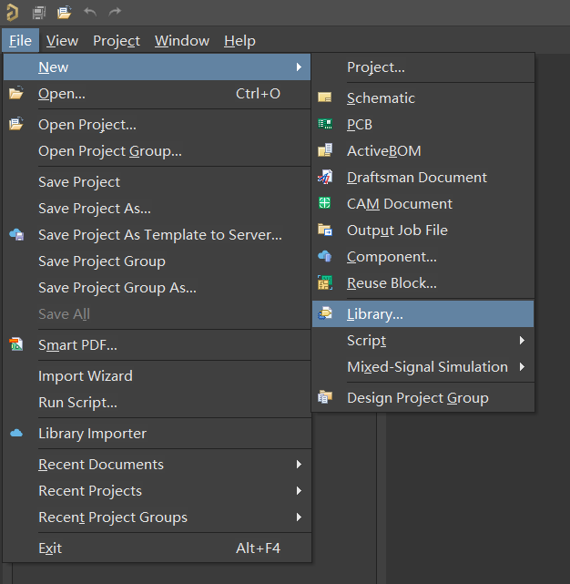
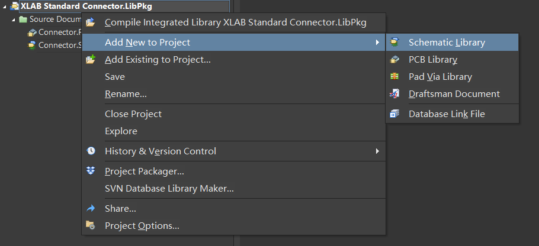
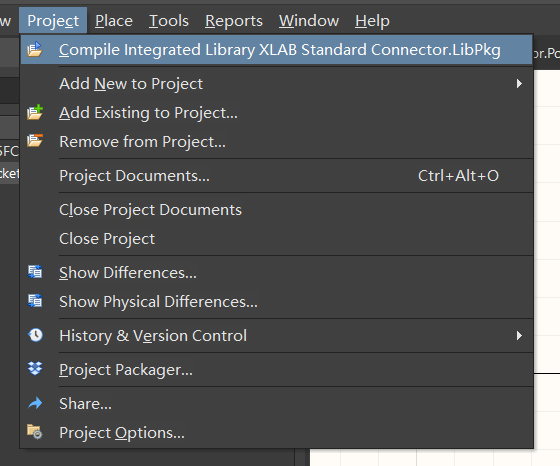
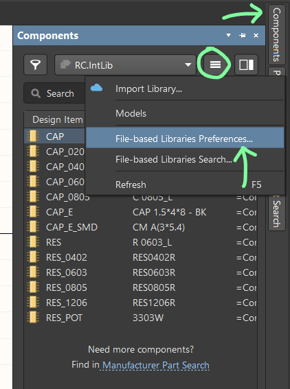

# AD元件库基本操作

- [AD元件库基本操作](#ad元件库基本操作)
  - [为什么要自己建立一个元件库](#为什么要自己建立一个元件库)
  - [AD元件库的基本逻辑](#ad元件库的基本逻辑)
  - [步骤](#步骤)
    - [新建](#新建)
    - [添加原理图符号](#添加原理图符号)
    - [添加封装](#添加封装)
    - [将封装绑定到原理图符号](#将封装绑定到原理图符号)
    - [编译](#编译)
    - [（可选）将编译好的库添加到AD环境中](#可选将编译好的库添加到ad环境中)

## 为什么要自己建立一个元件库
你可以在tb上可以买到很多现成的元件库，也可以在AD自带的 Manufacturer Part Search 在线工具里找到一些国外经销商（主要是Digikey）提供的器件封装。但是，总地来说，前者的质量良莠不齐，许多库甚至不能保证元件原理图符号的一致；后者则与中国的电子产业严重脱节，连 AO3400 或 CH340 这样国内常见的型号也找不到。

**作为一个DIYer，你日常用到的元件封装不会太多，而且很可能罹患严重的强迫症**，因此为自己建立一个常用库是非常必要且现实的。

另一方面，如果你所在的小团体需要通力合作，并且已经发展出了采购、工业设计这样的分工，建立一个组织用的标准库绝对会令你们事半功倍。不要等到采购员买到的连接器对不上PCB、工程师画的板子塞不进外壳，才想起统一各种器件的标准。

## AD元件库的基本逻辑
AD的库（Library / lib）有三种：
- 原理图库，.Schlib
- 封装库，.Pcblib
- 集成库，.Intlib

一般来说，如果你的库只作用于特定工程，你可能会建立一个Schlib，并在库中绑定工程外的某个Pcblib中的封装。但是，我们现在讨论的是一个综合性的、跨工程的标准库，因此建立的是一个Intlib。

简单来说，Intlib的逻辑是这样的：你在一个独立的工程中维护这个lib，并在其中建立一个或多个原理图库和封装库，然后进行**编译**。编译完成后，这个工程中的各种约束和依赖关系对其他人来说都是不透明的，正如其名，是一个“Integrated”的库。你可以把编译后的库文件添加到其他工程中去，也可以直接添加到AD环境中去，有点类似系统变量。

下面以XLAB标准连接器库为例，介绍如何建立和维护一个Intlib。

## 步骤
### 新建

以上三图：建立一个Intlib，并添加一个Schlib。

### 添加原理图符号

**在开始画之前，务必确认工作区当前的Grid大小**，你可以窗口最左下角的信息栏中看到这个数值。我的习惯是以100mil为最小单位画图，所以我原理图符号的引脚都会在以100mil为间隔的格点上。可想而知，如果引脚在原理图上出现在150mil或3,999mil这样的位置上，就不可能被任何导线连接。恐怖的是有时候你自己注意不到这个问题。

好消息是，需要你动手画的元件无非就是RLC和某些变压器（其实变压器没有什么复用性，一般会出现在各个工程自己的小库里）。

对于大部分连接器或IC，可以用AD的Symbol Wizard工具快速生成原理图符号：

具体怎么用其实犯不上细说。

### 添加封装
入口和Schlib差不多。不多说了。画就完了。

### 将封装绑定到原理图符号

### 编译

### （可选）将编译好的库添加到AD环境中

