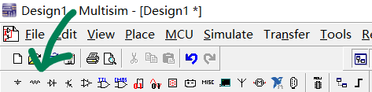
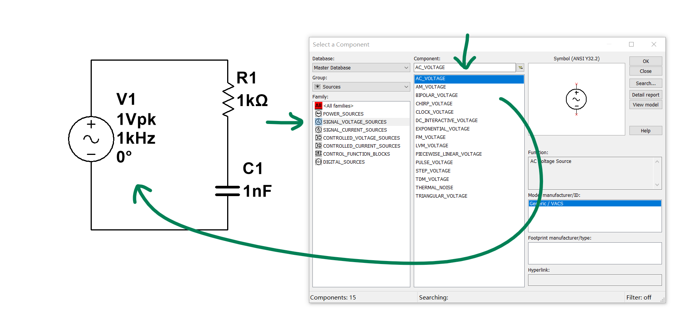

# Multisim

    This document is written in English, only because my TOEFL test is on tomorrow morning. If you have difficulties with language, simply use translation plugins.

    Before reading passage, let's assume that you have comprehended some basic concept of electronics, e.g. RC filter, opamps, MOSFETs, and so on.

- [Multisim](#multisim)
  - [Start with an RC filter](#start-with-an-rc-filter)
  - [Transient Simulation](#transient-simulation)
  - [AC Sweep](#ac-sweep)
  - [More](#more)

## Start with an RC filter

Let's build a first-order RC filter to go through some basic operations.

If you are reading this passage, I'm pretty sure that you can definitely find out how to drag components onto the schematic, so I'm just showing the screenshots without explaining what to do.

    Kindly reminder: don't forget to set a GROUND, in other words, reference point for EVERY circuit.

## Transient Simulation

As human beings, when we try to investigate some new stuff, we intrinsically wish to see "how it goes". In a more scientific language, that's to say "what's the result of it in the time domain".

In Mulisim, time domain analysis is called **Transient Simulation**, which is one of the most frequently used function.

1. Select Transient Simulation as the active analysis.
   
    

1. Determine the parameters for a transient simulation.
   
    

  - **Initial conditions**:
    - **Set to zero**, all energy-storing components (capacitors and inductors) store nothing at t=0.
    - **User defined**, literally, user defined.
    - **Calculate DC operating point**, what's normally what it does when you choose 'Determine automatically'. The software assume the steady state is reached at t=0.
    - **Determine automatically**, choose it as a start.

  - **End time**: How long will the simulation go. In our example, the source runs at 100kHz, so a 1e-4 seconds run is long enough to observe the output waveform.
  - **TMAX**: Time step of the simulation. A shorter TMAX leads to better resolution and heavier CPU usage, which means slower simulation speed.

  Once you are done, just save it.

1. Put some probes on it.
   
    

  - The 'V' probes measures the **potential** of certain nodes.
  - The 'A' probes measures the **current** flowing through certain branches.
  - The 'W' probes should be put directly ON the component, it measures the **power consumption**.
  - The '$\pm$V' probes measures the **voltage drop** between two nodes.
  - The 'A/V' probes also measures the power, but it does it in a traditional voltage-current style.

        Notice that probes can be used to define the output of any analysis, not only the transient simulation.

1. Run it. (Click the green 'play' button)
    

That's what you should get if everything goes right. You can see clearly that the output voltage (the green line) is somewhat smaller and lags the source voltage.

In the 'Output View' window, you can polish the waveform with several settings. Normally, the background color, the line width and grids are what we start with. After that, you can export the waveform as an image, or the whole raw data in .csv format. Sometimes I export the csv file and do some further analysis in MATLAB.

## AC Sweep

You might have heard that all important stuff locate in the frequency domain, at least in the field of signal processing.

By doing an AC sweep, you can observe how does a certain circuit respond to the input of different frequency.

    Be aware of the difference between a Fourier analysis and an AC sweep

1. Select the AC Sweep as the active analysis, just as what you've done in the transient simulation. Don't forget to insert a V-probe at the output node.
   
    

  - **FSTART & FSTOP**: The range of frequency variation in which the sweep goes.
  - **Sweep type**: 
    - **Decade**: the x-axis of the output graph is in the logarithm of 10.
    - **Octave**: the x-axis is in the logarithm of 8.
  - **Number of points**: a larger number of this leads to better resolution, and predictably longer simulation time.However, the extra time consumption here is not as serious as in the transient simulation. I usually set 1000 as a start.
  - **Vertical scale**:
    - **Logarithmic**: the y-axis is in the logarithm of 10.
    - **Decibel**: the y-axis is in decibel (dB).
  
  Once you are done with the settings, save them or run at once.

  

  Here I toggle the grid on for clarity. You can see the -3dB point of our first-order RC filter is around 100kHz~200kHz.

## More

There's a lot more you can do. It's actually quite easy to start any simulation and analyze the data, as you should have found out. Here's a list of what you might want to give a try:

- **Pole zero**: often used to investigate the performance of a control system, or a filter.
- **Fourier**: determine the frequency spectrum of a signal.
- **Parameter sweep**: quite useful to tune some components.
- **Monte Carlo**: get a insight of what impact do the errors of components make
  

